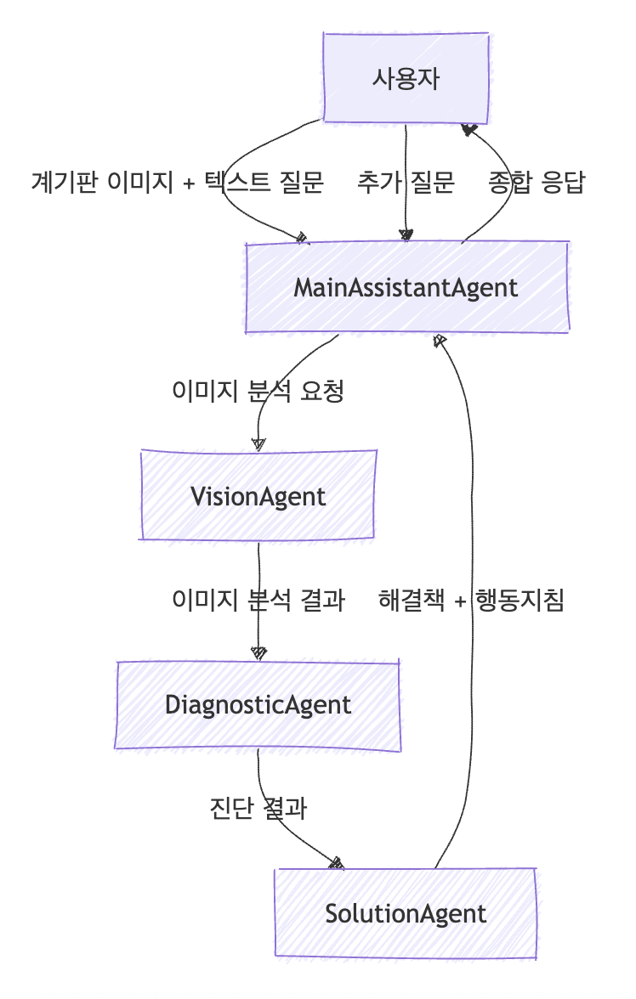

# LINUS: 멀티 에이전트 AI 기반 차량 계기판 위험 요소 분석 시스템

## 프로젝트 소개
LINUS는 2025년 6월 21일 Build with AI 미니 해커톤에서 개발한 차량 계기판 위험 요소 분석 프로젝트입니다. 본 프로젝트는 정확도 높은 서비스가 아닌, **멀티 에이전트 아키텍처의 가능성을 탐색하고 핵심 기능의 동작을 검증하는 MVP(Minimum Viable Product) 수준의 솔루션**을 제시합니다. 멀티 에이전트 기반으로 차량 계기판 이미지를 분석하여 문제를 진단하고 해결책을 제시하는 시스템의 프로토타입을 구현했습니다.

### 프로젝트 목표 및 동기
운전 중 마주하는 갑작스러운 계기판 경고등은, 특히 차량에 익숙하지 않은 운전자에게 당황스러움과 불안감을 줍니다. 경고등의 의미를 몰라 인터넷을 검색하거나 주변에 물어보는 동안, 자칫 위험한 상황을 초래하거나 불필요한 수리를 하는 등 잘못된 판단을 내릴 위험이 있습니다.

LINUS(Light + Us)는 이러한 문제점의 솔루션을 제시합니다. 운전자가 계기판 상태에 대해 질문하면, AI 에이전트가 계기판 이미지를 가져와 위험 요소를 분석하고 명확한 행동 지침을 제공하여 운전자의 안전하고 신속한 의사결정을 돕는 것을 목표로 합니다.

### 주요 기능
- **계기판 이미지 분석**: 사진 속 경고등 및 게이지 상태를 자동으로 식별합니다.
- **위험도 평가**: 문제의 심각도를 평가하고 여러 문제가 동시에 발생했을 때 해결 우선순위를 제시합니다.
- **행동 지침 제공**: 위험도에 따라 '즉시 정차', '주의 운전' 등 명확하고 즉각적인 행동 지침을 제공합니다.
- **솔루션 제안**: 예상 수리 비용, 정비 필요성 등 현실적인 해결책을 안내합니다.

## 에이전트 시스템
LINUS는 각자 전문 분야를 가진 AI 에이전트들이 협력하여 최적의 결과를 도출하는 멀티 에이전트 시스템으로 구성됩니다.

### 소통 에이전트
**Main Assistant (메인 어시스턴트)**
   - 사용자와의 소통
   - 전문가 분석 결과 요약
   - 이해하기 쉬운 설명 제공

### 전문가 에이전트
1. **Vision Expert Agent**
   - 계기판 이미지 분석
   - 경고등 및 게이지 상태 파악
   - 이미지 품질 평가

2. **Diagnostic Expert Agent**
   - 문제 심각도 평가
   - 연관성 분석
   - 잠재 위험 예측

3. **Solution Expert Agent**
   - 상황별 해결책 제시
   - 비용/시간 추정
   - 긴급 대처 방안 제공

## 코드 구현 및 실행 결과
본 프로젝트는 주피터 노트북 환경에서 진행하였으며 코드 구현과 실행 결과는 `LINUS.ipynb` 파일에 기술되어 있습니다.
